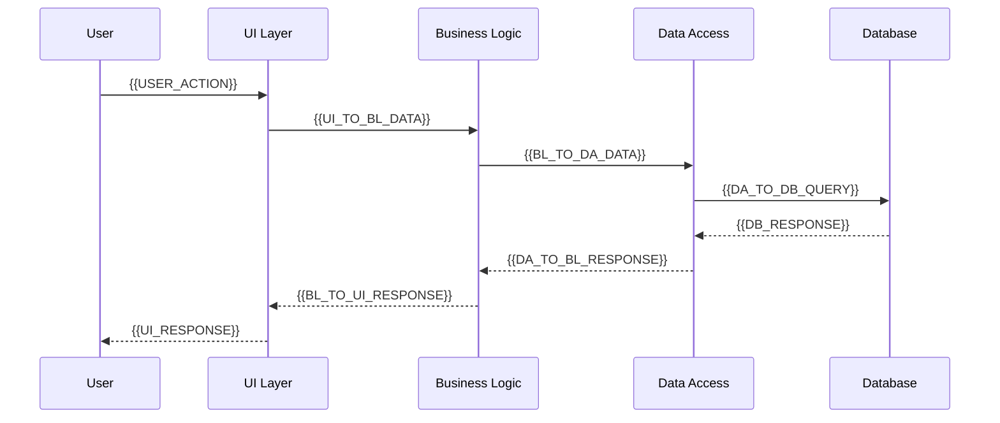

# 组件架构文档 | Component Architecture

*{{PROJECT_NAME}} 组件设计和架构说明*

---

## 🏗️ 整体架构

### 架构概览
```mermaid
graph TB
    A[用户界面层] --> B[业务逻辑层]
    B --> C[数据访问层]
    C --> D[数据存储层]
    
    subgraph "用户界面层"
        A1[{{UI_COMPONENT_1}}]
        A2[{{UI_COMPONENT_2}}]
        A3[{{UI_COMPONENT_3}}]
    end
    
    subgraph "业务逻辑层"
        B1[{{BUSINESS_COMPONENT_1}}]
        B2[{{BUSINESS_COMPONENT_2}}]
        B3[{{BUSINESS_COMPONENT_3}}]
    end
    
    subgraph "数据访问层"
        C1[{{DATA_ACCESS_1}}]
        C2[{{DATA_ACCESS_2}}]
    end
```

### 分层说明
- **用户界面层**: {{UI_LAYER_DESCRIPTION}}
- **业务逻辑层**: {{BUSINESS_LAYER_DESCRIPTION}}
- **数据访问层**: {{DATA_LAYER_DESCRIPTION}}
- **数据存储层**: {{STORAGE_LAYER_DESCRIPTION}}

---

## 📦 核心组件

### {{CORE_COMPONENT_1}}

**职责**: {{COMPONENT_1_RESPONSIBILITY}}

**文件位置**: `{{COMPONENT_1_PATH}}`

**主要接口**:
```{{LANGUAGE}}
{{COMPONENT_1_INTERFACE}}
```

**依赖关系**:
- 依赖: {{COMPONENT_1_DEPENDENCIES}}
- 被依赖: {{COMPONENT_1_DEPENDENTS}}

**配置参数**:
```{{CONFIG_FORMAT}}
{{COMPONENT_1_CONFIG}}
```

### {{CORE_COMPONENT_2}}

**职责**: {{COMPONENT_2_RESPONSIBILITY}}

**文件位置**: `{{COMPONENT_2_PATH}}`

**主要接口**:
```{{LANGUAGE}}
{{COMPONENT_2_INTERFACE}}
```

**状态管理**:
- **状态类型**: {{STATE_TYPE}}
- **状态更新**: {{STATE_UPDATE_METHOD}}
- **状态持久化**: {{STATE_PERSISTENCE}}

### {{CORE_COMPONENT_3}}

**职责**: {{COMPONENT_3_RESPONSIBILITY}}

**数据流**:
```
{{INPUT_DATA}} → [{{COMPONENT_3}}] → {{OUTPUT_DATA}}
```

**错误处理**:
- **错误类型**: {{ERROR_TYPES}}
- **恢复策略**: {{RECOVERY_STRATEGY}}

---

## 🔄 数据流设计

### 主要数据流


### 异步处理
- **消息队列**: {{MESSAGE_QUEUE_TYPE}}
- **事件驱动**: {{EVENT_DRIVEN_PATTERN}}
- **背景任务**: {{BACKGROUND_TASKS}}

---

## 🔌 接口设计

### 内部接口

#### {{INTERNAL_API_1}}
```{{LANGUAGE}}
{{INTERNAL_API_1_DEFINITION}}
```
- **用途**: {{INTERNAL_API_1_PURPOSE}}
- **调用方**: {{INTERNAL_API_1_CALLERS}}
- **响应格式**: {{INTERNAL_API_1_RESPONSE}}

#### {{INTERNAL_API_2}}
```{{LANGUAGE}}
{{INTERNAL_API_2_DEFINITION}}
```

### 外部接口

#### REST API
```http
{{HTTP_METHOD}} {{API_ENDPOINT}}
Content-Type: application/json

{{REQUEST_BODY_EXAMPLE}}
```

**响应示例**:
```json
{{RESPONSE_BODY_EXAMPLE}}
```

#### WebSocket 接口
```javascript
// 连接建立
{{WEBSOCKET_CONNECTION_CODE}}

// 消息格式
{{WEBSOCKET_MESSAGE_FORMAT}}
```

---

## 📱 组件分类

### UI 组件

#### 基础组件
| 组件名 | 文件路径 | 用途 | 复用性 |
|--------|----------|------|--------|
| {{UI_BASIC_1}} | {{UI_BASIC_1_PATH}} | {{UI_BASIC_1_PURPOSE}} | {{UI_BASIC_1_REUSE}} |
| {{UI_BASIC_2}} | {{UI_BASIC_2_PATH}} | {{UI_BASIC_2_PURPOSE}} | {{UI_BASIC_2_REUSE}} |

#### 复合组件
| 组件名 | 子组件 | 状态管理 | 性能考虑 |
|--------|--------|----------|----------|
| {{UI_COMPOSITE_1}} | {{UI_COMPOSITE_1_CHILDREN}} | {{UI_COMPOSITE_1_STATE}} | {{UI_COMPOSITE_1_PERF}} |
| {{UI_COMPOSITE_2}} | {{UI_COMPOSITE_2_CHILDREN}} | {{UI_COMPOSITE_2_STATE}} | {{UI_COMPOSITE_2_PERF}} |

### 业务组件

#### 服务层
```{{LANGUAGE}}
// {{SERVICE_1}} 服务
{{SERVICE_1_CODE_EXAMPLE}}
```

#### 工具类
```{{LANGUAGE}}
// {{UTILITY_1}} 工具
{{UTILITY_1_CODE_EXAMPLE}}
```

---

## 🔧 配置管理

### 组件配置
```{{CONFIG_FORMAT}}
{{COMPONENT_CONFIG_EXAMPLE}}
```

### 环境配置
- **开发环境**: {{DEV_CONFIG}}
- **测试环境**: {{TEST_CONFIG}}
- **生产环境**: {{PROD_CONFIG}}

### 动态配置
- **配置源**: {{CONFIG_SOURCE}}
- **更新机制**: {{CONFIG_UPDATE_MECHANISM}}
- **缓存策略**: {{CONFIG_CACHE_STRATEGY}}

---

## 📊 性能优化

### 组件性能

#### 渲染优化
- **懒加载**: {{LAZY_LOADING_STRATEGY}}
- **代码分割**: {{CODE_SPLITTING_STRATEGY}}
- **缓存策略**: {{CACHE_STRATEGY}}

#### 内存管理
- **内存泄漏预防**: {{MEMORY_LEAK_PREVENTION}}
- **对象池**: {{OBJECT_POOLING}}
- **垃圾回收**: {{GARBAGE_COLLECTION}}

### 性能监控
```{{LANGUAGE}}
// 性能监控代码
{{PERFORMANCE_MONITORING_CODE}}
```

---

## 🧪 测试策略

### 组件测试

#### 单元测试
```{{LANGUAGE}}
// {{COMPONENT_1}} 单元测试示例
{{UNIT_TEST_EXAMPLE}}
```

#### 集成测试
```{{LANGUAGE}}
// 组件集成测试
{{INTEGRATION_TEST_EXAMPLE}}
```

#### E2E测试
```{{LANGUAGE}}
// 端到端测试
{{E2E_TEST_EXAMPLE}}
```

### 测试工具
- **测试框架**: {{TEST_FRAMEWORK}}
- **Mock工具**: {{MOCK_TOOLS}}
- **覆盖率工具**: {{COVERAGE_TOOLS}}

---

## 🔐 安全考虑

### 输入验证
```{{LANGUAGE}}
// 输入验证示例
{{INPUT_VALIDATION_EXAMPLE}}
```

### 权限控制
- **认证机制**: {{AUTHENTICATION_MECHANISM}}
- **授权策略**: {{AUTHORIZATION_STRATEGY}}
- **角色管理**: {{ROLE_MANAGEMENT}}

### 数据保护
- **敏感数据处理**: {{SENSITIVE_DATA_HANDLING}}
- **加密策略**: {{ENCRYPTION_STRATEGY}}
- **审计日志**: {{AUDIT_LOGGING}}

---

## 🚀 部署架构

### 部署模式
```yaml
# 部署配置示例
{{DEPLOYMENT_CONFIG_EXAMPLE}}
```

### 扩展策略
- **水平扩展**: {{HORIZONTAL_SCALING}}
- **垂直扩展**: {{VERTICAL_SCALING}}
- **负载均衡**: {{LOAD_BALANCING}}

### 监控和告警
- **健康检查**: {{HEALTH_CHECK_ENDPOINTS}}
- **指标收集**: {{METRICS_COLLECTION}}
- **告警规则**: {{ALERT_RULES}}

---

## 📚 开发指南

### 添加新组件
1. {{ADD_COMPONENT_STEP_1}}
2. {{ADD_COMPONENT_STEP_2}}
3. {{ADD_COMPONENT_STEP_3}}

### 组件规范
```{{LANGUAGE}}
// 组件模板
{{COMPONENT_TEMPLATE}}
```

### 代码审查清单
- [ ] {{CODE_REVIEW_ITEM_1}}
- [ ] {{CODE_REVIEW_ITEM_2}}
- [ ] {{CODE_REVIEW_ITEM_3}}

---

## 🔄 维护和升级

### 版本兼容性
- **向后兼容**: {{BACKWARD_COMPATIBILITY}}
- **版本策略**: {{VERSIONING_STRATEGY}}
- **迁移指南**: {{MIGRATION_GUIDE}}

### 重构计划
- **技术债务**: {{TECHNICAL_DEBT}}
- **重构优先级**: {{REFACTOR_PRIORITY}}
- **时间安排**: {{REFACTOR_TIMELINE}}

---

## 📞 团队和联系

### 架构团队
- **架构师**: {{ARCHITECT_NAME}} ({{ARCHITECT_CONTACT}})
- **技术负责人**: {{TECH_LEAD}} ({{TECH_LEAD_CONTACT}})

### 组件负责人
| 组件 | 负责人 | 联系方式 |
|------|--------|----------|
| {{COMPONENT_1}} | {{OWNER_1}} | {{CONTACT_1}} |
| {{COMPONENT_2}} | {{OWNER_2}} | {{CONTACT_2}} |

---

**文档版本**: {{DOC_VERSION}}  
**最后更新**: {{LAST_UPDATE}}  
**下次审查**: {{NEXT_REVIEW_DATE}}

**注意**: 架构变更需要团队审查和批准。重大变更需要更新此文档。