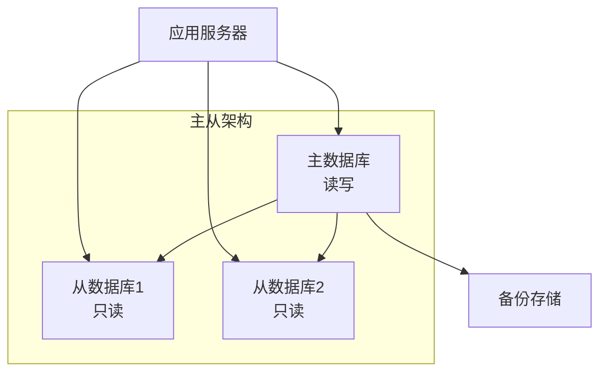

# 数据库架构文档 | Database Schema

*{{PROJECT_NAME}} 数据库设计和架构说明*

---

## 📋 数据库概览

**数据库信息**:
- **数据库类型**: {{DATABASE_TYPE}}
- **版本**: {{DATABASE_VERSION}}
- **字符集**: {{CHARSET}}
- **排序规则**: {{COLLATION}}
- **时区**: {{TIMEZONE}}

**连接信息**:
- **主库**: {{PRIMARY_DB_HOST}}:{{PRIMARY_DB_PORT}}
- **只读库**: {{READONLY_DB_HOST}}:{{READONLY_DB_PORT}}
- **数据库名**: {{DATABASE_NAME}}

---

## 🏗️ 整体架构

### 数据库拓扑


### 分库分表策略
- **分库策略**: {{SHARDING_STRATEGY}}
- **分表策略**: {{PARTITIONING_STRATEGY}}
- **路由规则**: {{ROUTING_RULES}}

---

## 📊 核心表结构

### {{TABLE_1}} 表

**表名**: `{{TABLE_1_NAME}}`  
**用途**: {{TABLE_1_PURPOSE}}  
**引擎**: {{TABLE_1_ENGINE}}  
**字符集**: {{TABLE_1_CHARSET}}

```sql
CREATE TABLE {{TABLE_1_NAME}} (
    {{FIELD_1}} {{FIELD_1_TYPE}} {{FIELD_1_CONSTRAINTS}} COMMENT '{{FIELD_1_COMMENT}}',
    {{FIELD_2}} {{FIELD_2_TYPE}} {{FIELD_2_CONSTRAINTS}} COMMENT '{{FIELD_2_COMMENT}}',
    {{FIELD_3}} {{FIELD_3_TYPE}} {{FIELD_3_CONSTRAINTS}} COMMENT '{{FIELD_3_COMMENT}}',
    {{TIMESTAMP_FIELDS}},
    
    PRIMARY KEY ({{PRIMARY_KEY_FIELDS}}),
    {{INDEXES}},
    {{FOREIGN_KEYS}}
) ENGINE={{TABLE_1_ENGINE}} DEFAULT CHARSET={{TABLE_1_CHARSET}} COMMENT='{{TABLE_1_COMMENT}}';
```

**字段说明**:
| 字段名 | 类型 | 长度 | 是否空 | 默认值 | 说明 |
|--------|------|------|--------|--------|------|
| {{FIELD_1}} | {{FIELD_1_TYPE}} | {{FIELD_1_LENGTH}} | {{FIELD_1_NULL}} | {{FIELD_1_DEFAULT}} | {{FIELD_1_COMMENT}} |
| {{FIELD_2}} | {{FIELD_2_TYPE}} | {{FIELD_2_LENGTH}} | {{FIELD_2_NULL}} | {{FIELD_2_DEFAULT}} | {{FIELD_2_COMMENT}} |
| {{FIELD_3}} | {{FIELD_3_TYPE}} | {{FIELD_3_LENGTH}} | {{FIELD_3_NULL}} | {{FIELD_3_DEFAULT}} | {{FIELD_3_COMMENT}} |

**索引设计**:
| 索引名 | 字段 | 类型 | 用途 |
|--------|------|------|------|
| {{INDEX_1_NAME}} | {{INDEX_1_FIELDS}} | {{INDEX_1_TYPE}} | {{INDEX_1_PURPOSE}} |
| {{INDEX_2_NAME}} | {{INDEX_2_FIELDS}} | {{INDEX_2_TYPE}} | {{INDEX_2_PURPOSE}} |

**业务规则**:
- {{BUSINESS_RULE_1}}
- {{BUSINESS_RULE_2}}
- {{BUSINESS_RULE_3}}

### {{TABLE_2}} 表

**表名**: `{{TABLE_2_NAME}}`  
**用途**: {{TABLE_2_PURPOSE}}

```sql
CREATE TABLE {{TABLE_2_NAME}} (
    {{T2_FIELD_1}} {{T2_FIELD_1_TYPE}} {{T2_FIELD_1_CONSTRAINTS}} COMMENT '{{T2_FIELD_1_COMMENT}}',
    {{T2_FIELD_2}} {{T2_FIELD_2_TYPE}} {{T2_FIELD_2_CONSTRAINTS}} COMMENT '{{T2_FIELD_2_COMMENT}}',
    {{T2_FIELD_3}} {{T2_FIELD_3_TYPE}} {{T2_FIELD_3_CONSTRAINTS}} COMMENT '{{T2_FIELD_3_COMMENT}}',
    
    PRIMARY KEY ({{T2_PRIMARY_KEY}}),
    FOREIGN KEY ({{T2_FK_FIELD}}) REFERENCES {{T2_REFERENCE_TABLE}}({{T2_REFERENCE_FIELD}})
        ON DELETE {{T2_DELETE_ACTION}} ON UPDATE {{T2_UPDATE_ACTION}}
) ENGINE={{TABLE_2_ENGINE}} DEFAULT CHARSET={{TABLE_2_CHARSET}};
```

### {{TABLE_3}} 表 (日志表)

**表名**: `{{LOG_TABLE_NAME}}`  
**用途**: {{LOG_TABLE_PURPOSE}}  
**分区策略**: {{LOG_PARTITION_STRATEGY}}

```sql
CREATE TABLE {{LOG_TABLE_NAME}} (
    {{LOG_ID_FIELD}} {{LOG_ID_TYPE}} AUTO_INCREMENT,
    {{LOG_USER_FIELD}} {{LOG_USER_TYPE}} NOT NULL,
    {{LOG_ACTION_FIELD}} {{LOG_ACTION_TYPE}} NOT NULL,
    {{LOG_DATA_FIELD}} {{LOG_DATA_TYPE}},
    {{LOG_IP_FIELD}} {{LOG_IP_TYPE}},
    {{LOG_TIME_FIELD}} {{LOG_TIME_TYPE}} DEFAULT CURRENT_TIMESTAMP,
    
    PRIMARY KEY ({{LOG_ID_FIELD}}, {{LOG_TIME_FIELD}}),
    INDEX idx_user_time ({{LOG_USER_FIELD}}, {{LOG_TIME_FIELD}}),
    INDEX idx_action_time ({{LOG_ACTION_FIELD}}, {{LOG_TIME_FIELD}})
) ENGINE={{LOG_ENGINE}}
PARTITION BY RANGE (YEAR({{LOG_TIME_FIELD}})) (
    PARTITION p2023 VALUES LESS THAN (2024),
    PARTITION p2024 VALUES LESS THAN (2025),
    PARTITION p2025 VALUES LESS THAN (2026),
    PARTITION pmax VALUES LESS THAN MAXVALUE
);
```

---

## 🔗 表关系图

### ER 图
```mermaid
erDiagram
    {{TABLE_1_NAME}} {
        {{FIELD_1_TYPE}} {{FIELD_1}}
        {{FIELD_2_TYPE}} {{FIELD_2}}
        {{FIELD_3_TYPE}} {{FIELD_3}}
    }
    
    {{TABLE_2_NAME}} {
        {{T2_FIELD_1_TYPE}} {{T2_FIELD_1}}
        {{T2_FIELD_2_TYPE}} {{T2_FIELD_2}}
        {{T2_FIELD_3_TYPE}} {{T2_FIELD_3}}
    }
    
    {{TABLE_3_NAME}} {
        {{T3_FIELD_1_TYPE}} {{T3_FIELD_1}}
        {{T3_FIELD_2_TYPE}} {{T3_FIELD_2}}
    }
    
    {{TABLE_1_NAME}} ||--o{ {{TABLE_2_NAME}} : "{{RELATIONSHIP_1}}"
    {{TABLE_2_NAME}} ||--o{ {{TABLE_3_NAME}} : "{{RELATIONSHIP_2}}"
```

### 关系说明
| 关系 | 主表 | 从表 | 关系类型 | 说明 |
|------|------|------|----------|------|
| {{RELATIONSHIP_1}} | {{TABLE_1_NAME}} | {{TABLE_2_NAME}} | {{RELATIONSHIP_1_TYPE}} | {{RELATIONSHIP_1_DESC}} |
| {{RELATIONSHIP_2}} | {{TABLE_2_NAME}} | {{TABLE_3_NAME}} | {{RELATIONSHIP_2_TYPE}} | {{RELATIONSHIP_2_DESC}} |

---

## 📊 视图设计

### {{VIEW_1_NAME}} 视图

**用途**: {{VIEW_1_PURPOSE}}

```sql
CREATE VIEW {{VIEW_1_NAME}} AS
SELECT 
    {{VIEW_1_SELECT_FIELDS}},
    {{VIEW_1_CALCULATED_FIELDS}}
FROM {{VIEW_1_FROM_TABLES}}
WHERE {{VIEW_1_CONDITIONS}}
ORDER BY {{VIEW_1_ORDER_BY}};
```

**字段说明**:
| 字段名 | 数据来源 | 计算逻辑 | 说明 |
|--------|----------|----------|------|
| {{VIEW_FIELD_1}} | {{VIEW_FIELD_1_SOURCE}} | {{VIEW_FIELD_1_LOGIC}} | {{VIEW_FIELD_1_DESC}} |
| {{VIEW_FIELD_2}} | {{VIEW_FIELD_2_SOURCE}} | {{VIEW_FIELD_2_LOGIC}} | {{VIEW_FIELD_2_DESC}} |

---

## 🔧 存储过程和函数

### {{PROCEDURE_1_NAME}} 存储过程

**用途**: {{PROCEDURE_1_PURPOSE}}

```sql
DELIMITER $$
CREATE PROCEDURE {{PROCEDURE_1_NAME}}(
    IN {{PARAM_1}} {{PARAM_1_TYPE}},
    IN {{PARAM_2}} {{PARAM_2_TYPE}},
    OUT {{OUT_PARAM}} {{OUT_PARAM_TYPE}}
)
BEGIN
    DECLARE {{DECLARE_VAR}} {{DECLARE_VAR_TYPE}} DEFAULT {{DEFAULT_VALUE}};
    
    -- {{PROCEDURE_LOGIC_COMMENT}}
    {{PROCEDURE_LOGIC}};
    
    -- 错误处理
    DECLARE CONTINUE HANDLER FOR SQLEXCEPTION
    BEGIN
        SET {{OUT_PARAM}} = -1;
        ROLLBACK;
    END;
    
    START TRANSACTION;
    {{TRANSACTION_LOGIC}};
    COMMIT;
    
    SET {{OUT_PARAM}} = {{SUCCESS_VALUE}};
END$$
DELIMITER ;
```

**参数说明**:
| 参数名 | 类型 | 方向 | 说明 |
|--------|------|------|------|
| {{PARAM_1}} | {{PARAM_1_TYPE}} | IN | {{PARAM_1_DESC}} |
| {{PARAM_2}} | {{PARAM_2_TYPE}} | IN | {{PARAM_2_DESC}} |
| {{OUT_PARAM}} | {{OUT_PARAM_TYPE}} | OUT | {{OUT_PARAM_DESC}} |

### {{FUNCTION_1_NAME}} 函数

```sql
DELIMITER $$
CREATE FUNCTION {{FUNCTION_1_NAME}}({{FUNC_PARAMS}})
RETURNS {{RETURN_TYPE}}
READS SQL DATA
DETERMINISTIC
BEGIN
    DECLARE {{FUNC_DECLARE_VAR}} {{FUNC_DECLARE_TYPE}};
    
    {{FUNCTION_LOGIC}};
    
    RETURN {{RETURN_VALUE}};
END$$
DELIMITER ;
```

---

## 🔍 索引优化策略

### 索引分析

#### 主要查询模式
1. **{{QUERY_PATTERN_1}}**: {{QUERY_PATTERN_1_DESC}}
   ```sql
   {{QUERY_PATTERN_1_SQL}}
   ```
   
2. **{{QUERY_PATTERN_2}}**: {{QUERY_PATTERN_2_DESC}}
   ```sql
   {{QUERY_PATTERN_2_SQL}}
   ```

#### 索引建议
| 表名 | 建议索引 | 查询优化 | 优先级 |
|------|----------|----------|--------|
| {{TABLE_1_NAME}} | {{SUGGESTED_INDEX_1}} | {{OPTIMIZATION_1}} | {{PRIORITY_1}} |
| {{TABLE_2_NAME}} | {{SUGGESTED_INDEX_2}} | {{OPTIMIZATION_2}} | {{PRIORITY_2}} |

### 索引监控
```sql
-- 查看索引使用情况
SELECT 
    table_name,
    index_name,
    seq_in_index,
    column_name
FROM information_schema.statistics 
WHERE table_schema = '{{DATABASE_NAME}}'
ORDER BY table_name, index_name, seq_in_index;

-- 查看未使用的索引
SELECT 
    s.table_schema,
    s.table_name,
    s.index_name
FROM information_schema.statistics s
LEFT JOIN performance_schema.table_io_waits_summary_by_index_usage u
    ON s.table_schema = u.object_schema 
    AND s.table_name = u.object_name 
    AND s.index_name = u.index_name
WHERE u.index_name IS NULL
    AND s.table_schema = '{{DATABASE_NAME}}';
```

---

## 🔐 安全设计

### 用户权限

#### 应用用户
```sql
-- 创建应用用户
CREATE USER '{{APP_USER}}'@'{{APP_HOST}}' IDENTIFIED BY '{{APP_PASSWORD}}';

-- 授予权限
GRANT SELECT, INSERT, UPDATE, DELETE ON {{DATABASE_NAME}}.* TO '{{APP_USER}}'@'{{APP_HOST}}';
GRANT EXECUTE ON PROCEDURE {{DATABASE_NAME}}.{{PROCEDURE_NAME}} TO '{{APP_USER}}'@'{{APP_HOST}}';
```

#### 只读用户
```sql
-- 创建只读用户
CREATE USER '{{READONLY_USER}}'@'{{READONLY_HOST}}' IDENTIFIED BY '{{READONLY_PASSWORD}}';

-- 授予只读权限
GRANT SELECT ON {{DATABASE_NAME}}.* TO '{{READONLY_USER}}'@'{{READONLY_HOST}}';
```

### 数据安全

#### 敏感数据加密
| 字段 | 加密方式 | 密钥管理 | 说明 |
|------|----------|----------|------|
| {{SENSITIVE_FIELD_1}} | {{ENCRYPTION_METHOD_1}} | {{KEY_MANAGEMENT_1}} | {{ENCRYPTION_DESC_1}} |
| {{SENSITIVE_FIELD_2}} | {{ENCRYPTION_METHOD_2}} | {{KEY_MANAGEMENT_2}} | {{ENCRYPTION_DESC_2}} |

#### 审计日志
```sql
-- 启用审计日志
SET GLOBAL log_bin_trust_function_creators = 1;

-- 创建审计触发器
CREATE TRIGGER {{AUDIT_TRIGGER_NAME}}
AFTER {{TRIGGER_EVENT}} ON {{AUDIT_TABLE}}
FOR EACH ROW
BEGIN
    INSERT INTO {{AUDIT_LOG_TABLE}} (
        table_name,
        operation,
        old_values,
        new_values,
        user,
        timestamp
    ) VALUES (
        '{{AUDIT_TABLE}}',
        '{{TRIGGER_EVENT}}',
        {{OLD_VALUES}},
        {{NEW_VALUES}},
        USER(),
        NOW()
    );
END;
```

---

## 📈 性能优化

### 查询优化

#### 慢查询监控
```sql
-- 启用慢查询日志
SET GLOBAL slow_query_log = 'ON';
SET GLOBAL long_query_time = {{SLOW_QUERY_THRESHOLD}};

-- 查看慢查询统计
SELECT 
    query_time,
    lock_time,
    rows_sent,
    rows_examined,
    sql_text
FROM mysql.slow_log
WHERE start_time >= DATE_SUB(NOW(), INTERVAL 1 DAY)
ORDER BY query_time DESC
LIMIT 10;
```

#### 执行计划分析
```sql
-- 分析关键查询
EXPLAIN FORMAT=JSON
{{CRITICAL_QUERY}};

-- 查看表统计信息
ANALYZE TABLE {{TABLE_NAME}};
SHOW TABLE STATUS LIKE '{{TABLE_NAME}}';
```

### 硬件配置建议

#### 服务器规格
| 环境 | CPU | 内存 | 存储 | 网络 |
|------|-----|------|------|------|
| 开发 | {{DEV_CPU}} | {{DEV_MEMORY}} | {{DEV_STORAGE}} | {{DEV_NETWORK}} |
| 测试 | {{TEST_CPU}} | {{TEST_MEMORY}} | {{TEST_STORAGE}} | {{TEST_NETWORK}} |
| 生产 | {{PROD_CPU}} | {{PROD_MEMORY}} | {{PROD_STORAGE}} | {{PROD_NETWORK}} |

#### 数据库配置
```ini
# {{DATABASE_TYPE}} 配置优化
[mysqld]
# 连接配置
max_connections = {{MAX_CONNECTIONS}}
max_connect_errors = {{MAX_CONNECT_ERRORS}}

# 缓存配置
innodb_buffer_pool_size = {{BUFFER_POOL_SIZE}}
query_cache_size = {{QUERY_CACHE_SIZE}}

# 日志配置
innodb_log_file_size = {{LOG_FILE_SIZE}}
innodb_log_buffer_size = {{LOG_BUFFER_SIZE}}

# 性能配置
innodb_flush_log_at_trx_commit = {{FLUSH_LOG_COMMIT}}
sync_binlog = {{SYNC_BINLOG}}
```

---

## 🔄 备份和恢复

### 备份策略

#### 全量备份
```bash
# 每日全量备份
#!/bin/bash
BACKUP_DIR="{{BACKUP_DIRECTORY}}"
DATE=$(date +%Y%m%d)
BACKUP_FILE="${BACKUP_DIR}/{{DATABASE_NAME}}_full_${DATE}.sql"

mysqldump \
    --host={{DB_HOST}} \
    --user={{BACKUP_USER}} \
    --password={{BACKUP_PASSWORD}} \
    --single-transaction \
    --routines \
    --triggers \
    --all-databases > ${BACKUP_FILE}

# 压缩备份文件
gzip ${BACKUP_FILE}
```

#### 增量备份
```bash
# 增量备份脚本
#!/bin/bash
BINLOG_DIR="{{BINLOG_DIRECTORY}}"
BACKUP_DIR="{{INCREMENTAL_BACKUP_DIR}}"
DATE=$(date +%Y%m%d_%H%M%S)

# 刷新二进制日志
mysql -u{{BACKUP_USER}} -p{{BACKUP_PASSWORD}} -e "FLUSH LOGS;"

# 复制二进制日志
cp ${BINLOG_DIR}/mysql-bin.* ${BACKUP_DIR}/binlog_${DATE}/
```

### 恢复流程

#### 完整恢复
```bash
# 1. 停止应用服务
systemctl stop {{APPLICATION_SERVICE}}

# 2. 恢复数据库
mysql -u{{RESTORE_USER}} -p{{RESTORE_PASSWORD}} < {{BACKUP_FILE}}

# 3. 应用增量日志
mysqlbinlog {{BINLOG_FILES}} | mysql -u{{RESTORE_USER}} -p{{RESTORE_PASSWORD}}

# 4. 验证数据完整性
mysql -u{{RESTORE_USER}} -p{{RESTORE_PASSWORD}} -e "{{VERIFICATION_QUERY}}"

# 5. 重启应用服务
systemctl start {{APPLICATION_SERVICE}}
```

#### 时间点恢复
```bash
# 恢复到指定时间点
mysqlbinlog \
    --start-datetime="{{START_TIME}}" \
    --stop-datetime="{{STOP_TIME}}" \
    {{BINLOG_FILES}} | mysql -u{{RESTORE_USER}} -p{{RESTORE_PASSWORD}}
```

---

## 📊 监控和告警

### 关键指标

#### 性能指标
| 指标 | 阈值 | 监控方法 | 告警级别 |
|------|------|----------|----------|
| QPS | > {{QPS_THRESHOLD}} | {{QPS_MONITOR}} | {{QPS_ALERT_LEVEL}} |
| 连接数 | > {{CONN_THRESHOLD}} | {{CONN_MONITOR}} | {{CONN_ALERT_LEVEL}} |
| 慢查询 | > {{SLOW_THRESHOLD}} | {{SLOW_MONITOR}} | {{SLOW_ALERT_LEVEL}} |
| 磁盘使用率 | > {{DISK_THRESHOLD}}% | {{DISK_MONITOR}} | {{DISK_ALERT_LEVEL}} |

#### 监控脚本
```sql
-- 数据库健康检查
SELECT 
    'Connection Status' AS metric,
    CASE 
        WHEN @@max_connections - @@threads_connected < 10 
        THEN 'WARNING' 
        ELSE 'OK' 
    END AS status,
    CONCAT(@@threads_connected, '/', @@max_connections) AS value;

SELECT 
    'Buffer Pool Hit Ratio' AS metric,
    CASE 
        WHEN hit_ratio < 95 
        THEN 'WARNING' 
        ELSE 'OK' 
    END AS status,
    CONCAT(ROUND(hit_ratio, 2), '%') AS value
FROM (
    SELECT 
        (1 - (Innodb_buffer_pool_reads / Innodb_buffer_pool_read_requests)) * 100 AS hit_ratio
    FROM INFORMATION_SCHEMA.GLOBAL_STATUS
    WHERE VARIABLE_NAME IN ('Innodb_buffer_pool_reads', 'Innodb_buffer_pool_read_requests')
) AS buffer_stats;
```

---

## 📚 运维指南

### 日常维护

#### 定期任务
```bash
# 数据库优化（每周执行）
#!/bin/bash
mysql -u{{ADMIN_USER}} -p{{ADMIN_PASSWORD}} << EOF
-- 优化表
OPTIMIZE TABLE {{TABLE_1_NAME}};
OPTIMIZE TABLE {{TABLE_2_NAME}};

-- 更新统计信息
ANALYZE TABLE {{TABLE_1_NAME}};
ANALYZE TABLE {{TABLE_2_NAME}};

-- 清理过期数据
DELETE FROM {{LOG_TABLE_NAME}} 
WHERE {{LOG_TIME_FIELD}} < DATE_SUB(NOW(), INTERVAL {{LOG_RETENTION_DAYS}} DAY);
EOF
```

#### 容量规划
| 表名 | 当前大小 | 增长速度 | 预计6个月 | 清理策略 |
|------|----------|----------|-----------|----------|
| {{TABLE_1_NAME}} | {{TABLE_1_SIZE}} | {{TABLE_1_GROWTH}} | {{TABLE_1_PROJECTED}} | {{TABLE_1_CLEANUP}} |
| {{TABLE_2_NAME}} | {{TABLE_2_SIZE}} | {{TABLE_2_GROWTH}} | {{TABLE_2_PROJECTED}} | {{TABLE_2_CLEANUP}} |

### 故障处理

#### 常见问题
1. **连接数耗尽**
   - 症状: `Too many connections`
   - 解决: 增加 `max_connections` 或优化连接池
   
2. **锁等待超时**
   - 症状: `Lock wait timeout exceeded`
   - 解决: 查找长时间运行的事务并终止

3. **磁盘空间不足**
   - 症状: `No space left on device`
   - 解决: 清理日志文件或扩容磁盘

---

## 🔄 数据迁移

### 版本升级

#### 升级检查清单
- [ ] 备份当前数据库
- [ ] 测试升级脚本
- [ ] 检查应用兼容性
- [ ] 准备回滚方案

#### 升级脚本模板
```sql
-- 版本 {{OLD_VERSION}} 升级到 {{NEW_VERSION}}
START TRANSACTION;

-- 备份关键表结构
CREATE TABLE {{TABLE_1_NAME}}_backup_{{UPGRADE_DATE}} LIKE {{TABLE_1_NAME}};
INSERT INTO {{TABLE_1_NAME}}_backup_{{UPGRADE_DATE}} SELECT * FROM {{TABLE_1_NAME}};

-- 执行升级操作
{{UPGRADE_SQL_STATEMENTS}};

-- 验证升级结果
{{VERIFICATION_QUERIES}};

-- 如果验证通过则提交，否则回滚
COMMIT;
-- ROLLBACK;
```

---

## 📞 联系信息

### DBA 团队
- **首席DBA**: {{LEAD_DBA}} ({{LEAD_DBA_CONTACT}})
- **运维DBA**: {{OPS_DBA}} ({{OPS_DBA_CONTACT}})
- **开发DBA**: {{DEV_DBA}} ({{DEV_DBA_CONTACT}})

### 紧急联系
- **7x24小时值班**: {{EMERGENCY_PHONE}}
- **技术支持群**: {{SUPPORT_GROUP}}
- **故障报告**: {{INCIDENT_REPORT_EMAIL}}

---

**文档版本**: {{DOC_VERSION}}  
**数据库版本**: {{DATABASE_VERSION}}  
**最后更新**: {{LAST_UPDATE}}  
**下次审查**: {{NEXT_REVIEW_DATE}}

**注意**: 数据库结构变更需要经过DBA团队审核。生产环境变更需要提前申请和备案。