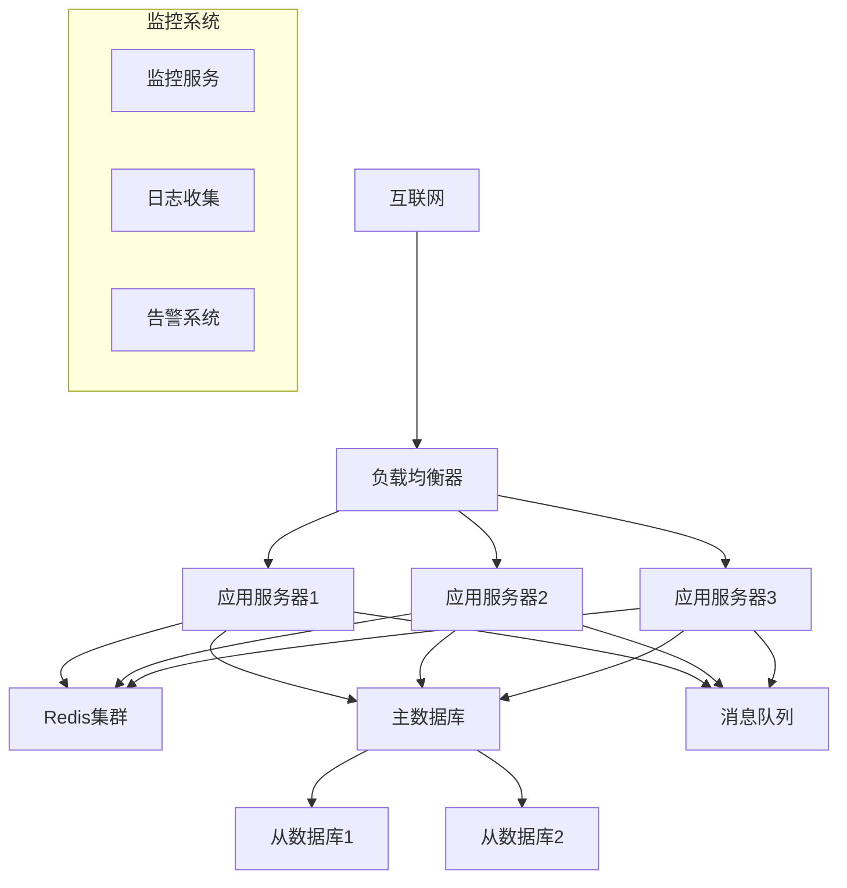

# 部署指南 | Deployment Guide

*{{PROJECT_NAME}} 部署流程和运维指南*

---

## 📋 部署概览

**项目信息**:
- **项目名称**: {{PROJECT_NAME}}
- **版本**: {{PROJECT_VERSION}}
- **部署类型**: {{DEPLOYMENT_TYPE}}
- **目标环境**: {{TARGET_ENVIRONMENTS}}

**部署架构**:
- **应用服务器**: {{APP_SERVER_COUNT}} 台
- **数据库**: {{DATABASE_TYPE}} {{DATABASE_VERSION}}
- **负载均衡**: {{LOAD_BALANCER_TYPE}}
- **缓存**: {{CACHE_TYPE}}

---

## 🏗️ 环境架构

### 生产环境架构


### 网络规划
| 组件 | 内网IP | 外网IP | 端口 | 防火墙规则 |
|------|--------|--------|------|-----------|
| 负载均衡器 | {{LB_INTERNAL_IP}} | {{LB_EXTERNAL_IP}} | {{LB_PORTS}} | {{LB_FIREWALL}} |
| 应用服务器1 | {{APP1_IP}} | - | {{APP_PORTS}} | {{APP_FIREWALL}} |
| 应用服务器2 | {{APP2_IP}} | - | {{APP_PORTS}} | {{APP_FIREWALL}} |
| 数据库主库 | {{DB_MASTER_IP}} | - | {{DB_PORT}} | {{DB_FIREWALL}} |
| Redis集群 | {{REDIS_IPS}} | - | {{REDIS_PORT}} | {{REDIS_FIREWALL}} |

---

## 🛠️ 环境准备

### 服务器规格要求

#### 生产环境
| 组件 | CPU | 内存 | 磁盘 | 网络 | 数量 |
|------|-----|------|------|------|------|
| 应用服务器 | {{PROD_APP_CPU}} | {{PROD_APP_MEMORY}} | {{PROD_APP_DISK}} | {{PROD_APP_NETWORK}} | {{PROD_APP_COUNT}} |
| 数据库服务器 | {{PROD_DB_CPU}} | {{PROD_DB_MEMORY}} | {{PROD_DB_DISK}} | {{PROD_DB_NETWORK}} | {{PROD_DB_COUNT}} |
| 缓存服务器 | {{PROD_CACHE_CPU}} | {{PROD_CACHE_MEMORY}} | {{PROD_CACHE_DISK}} | {{PROD_CACHE_NETWORK}} | {{PROD_CACHE_COUNT}} |

#### 测试环境
| 组件 | CPU | 内存 | 磁盘 | 网络 | 数量 |
|------|-----|------|------|------|------|
| 应用服务器 | {{TEST_APP_CPU}} | {{TEST_APP_MEMORY}} | {{TEST_APP_DISK}} | {{TEST_APP_NETWORK}} | {{TEST_APP_COUNT}} |
| 数据库服务器 | {{TEST_DB_CPU}} | {{TEST_DB_MEMORY}} | {{TEST_DB_DISK}} | {{TEST_DB_NETWORK}} | {{TEST_DB_COUNT}} |

### 软件环境

#### 基础软件
```bash
# 操作系统版本
{{OS_NAME}} {{OS_VERSION}}

# 必需软件包
{{REQUIRED_PACKAGES}}

# 运行时环境
{{RUNTIME_ENVIRONMENT}} {{RUNTIME_VERSION}}

# 数据库
{{DATABASE_TYPE}} {{DATABASE_VERSION}}

# Web服务器
{{WEB_SERVER_TYPE}} {{WEB_SERVER_VERSION}}
```

#### 依赖服务
- **消息队列**: {{MESSAGE_QUEUE_TYPE}} {{MESSAGE_QUEUE_VERSION}}
- **缓存系统**: {{CACHE_TYPE}} {{CACHE_VERSION}}
- **监控系统**: {{MONITORING_SYSTEM}}
- **日志系统**: {{LOGGING_SYSTEM}}

---

## 📦 部署流程

### 1. 代码构建

#### 构建环境准备
```bash
# 安装构建工具
{{BUILD_TOOL_INSTALL_COMMANDS}}

# 安装项目依赖
{{DEPENDENCY_INSTALL_COMMANDS}}

# 环境变量配置
export {{BUILD_ENV_VAR_1}}={{BUILD_ENV_VALUE_1}}
export {{BUILD_ENV_VAR_2}}={{BUILD_ENV_VALUE_2}}
```

#### 构建命令
```bash
# 清理旧构建
{{CLEAN_COMMAND}}

# 执行构建
{{BUILD_COMMAND}}

# 运行测试
{{TEST_COMMAND}}

# 构建产物检查
{{BUILD_ARTIFACT_CHECK}}
```

#### 构建产物
```bash
# 构建输出目录
{{BUILD_OUTPUT_DIR}}/
├── {{APP_BINARY}}              # 应用程序主文件
├── {{CONFIG_DIR}}/             # 配置文件目录
├── {{STATIC_DIR}}/             # 静态资源目录
├── {{DEPENDENCIES_DIR}}/       # 依赖库目录
└── {{SCRIPTS_DIR}}/            # 部署脚本目录
```

### 2. 环境配置

#### 配置文件模板
```yaml
# {{CONFIG_FILE_NAME}}
{{CONFIG_TEMPLATE_CONTENT}}
```

#### 环境变量
```bash
# 生产环境变量
export {{PROD_ENV_VAR_1}}="{{PROD_ENV_VALUE_1}}"
export {{PROD_ENV_VAR_2}}="{{PROD_ENV_VALUE_2}}"
export {{PROD_ENV_VAR_3}}="{{PROD_ENV_VALUE_3}}"

# 数据库连接
export {{DB_HOST_VAR}}="{{PROD_DB_HOST}}"
export {{DB_PORT_VAR}}="{{PROD_DB_PORT}}"
export {{DB_NAME_VAR}}="{{PROD_DB_NAME}}"
export {{DB_USER_VAR}}="{{PROD_DB_USER}}"
export {{DB_PASS_VAR}}="{{PROD_DB_PASS}}"

# 缓存配置
export {{CACHE_HOST_VAR}}="{{PROD_CACHE_HOST}}"
export {{CACHE_PORT_VAR}}="{{PROD_CACHE_PORT}}"
```

### 3. 数据库部署

#### 数据库初始化
```bash
# 创建数据库
{{DB_CREATE_COMMAND}}

# 创建用户和权限
{{DB_USER_CREATE_COMMAND}}

# 导入初始结构
{{DB_SCHEMA_IMPORT_COMMAND}}

# 导入初始数据
{{DB_DATA_IMPORT_COMMAND}}
```

#### 数据库迁移
```bash
# 检查当前版本
{{DB_VERSION_CHECK_COMMAND}}

# 执行迁移
{{DB_MIGRATION_COMMAND}}

# 验证迁移结果
{{DB_MIGRATION_VERIFY_COMMAND}}
```

### 4. 应用部署

#### 部署脚本
```bash
#!/bin/bash
# 部署脚本 deploy.sh

set -e

# 配置变量
APP_NAME="{{PROJECT_NAME}}"
APP_VERSION="{{PROJECT_VERSION}}"
DEPLOY_DIR="{{DEPLOY_DIRECTORY}}"
BACKUP_DIR="{{BACKUP_DIRECTORY}}"
SERVICE_NAME="{{SERVICE_NAME}}"

echo "开始部署 $APP_NAME v$APP_VERSION"

# 1. 停止服务
echo "停止应用服务..."
systemctl stop $SERVICE_NAME

# 2. 备份当前版本
echo "备份当前版本..."
if [ -d "$DEPLOY_DIR" ]; then
    mv "$DEPLOY_DIR" "$BACKUP_DIR/backup_$(date +%Y%m%d_%H%M%S)"
fi

# 3. 部署新版本
echo "部署新版本..."
mkdir -p "$DEPLOY_DIR"
{{DEPLOYMENT_COPY_COMMANDS}}

# 4. 设置权限
echo "设置文件权限..."
chown -R {{APP_USER}}:{{APP_GROUP}} "$DEPLOY_DIR"
chmod -R {{APP_PERMISSIONS}} "$DEPLOY_DIR"

# 5. 更新配置
echo "更新配置文件..."
{{CONFIG_UPDATE_COMMANDS}}

# 6. 启动服务
echo "启动应用服务..."
systemctl start $SERVICE_NAME

# 7. 验证部署
echo "验证部署结果..."
sleep 10
{{DEPLOYMENT_VERIFICATION_COMMANDS}}

echo "部署完成！"
```

#### 服务配置
```ini
# systemd 服务配置 {{SERVICE_NAME}}.service
[Unit]
Description={{PROJECT_NAME}} Application
After=network.target

[Service]
Type={{SERVICE_TYPE}}
User={{APP_USER}}
Group={{APP_GROUP}}
WorkingDirectory={{DEPLOY_DIRECTORY}}
ExecStart={{EXEC_START_COMMAND}}
ExecReload={{EXEC_RELOAD_COMMAND}}
ExecStop={{EXEC_STOP_COMMAND}}
Restart={{RESTART_POLICY}}
RestartSec={{RESTART_DELAY}}

# 环境变量
Environment={{SERVICE_ENV_VARS}}

# 资源限制
LimitNOFILE={{FILE_LIMIT}}
LimitNPROC={{PROCESS_LIMIT}}

[Install]
WantedBy=multi-user.target
```

---

## 🔧 配置管理

### 配置文件结构
```
{{CONFIG_ROOT_DIR}}/
├── environments/
│   ├── development.{{CONFIG_EXT}}
│   ├── testing.{{CONFIG_EXT}}
│   ├── staging.{{CONFIG_EXT}}
│   └── production.{{CONFIG_EXT}}
├── modules/
│   ├── database.{{CONFIG_EXT}}
│   ├── cache.{{CONFIG_EXT}}
│   ├── logging.{{CONFIG_EXT}}
│   └── security.{{CONFIG_EXT}}
└── secrets/
    ├── database.secret
    ├── api_keys.secret
    └── certificates/
```

### 配置管理工具
```bash
# 使用 {{CONFIG_MANAGEMENT_TOOL}}
{{CONFIG_TOOL_INSTALL_COMMAND}}

# 配置模板渲染
{{CONFIG_TEMPLATE_RENDER_COMMAND}}

# 配置验证
{{CONFIG_VALIDATION_COMMAND}}

# 配置热更新
{{CONFIG_RELOAD_COMMAND}}
```

### 敏感信息管理
```bash
# 密钥管理
{{SECRET_MANAGEMENT_TOOL}} put secret/{{PROJECT_NAME}}/database/password "{{DB_PASSWORD}}"
{{SECRET_MANAGEMENT_TOOL}} put secret/{{PROJECT_NAME}}/api/key "{{API_KEY}}"

# 证书管理
{{CERT_MANAGEMENT_COMMANDS}}
```

---

## 🚀 自动化部署

### CI/CD 流水线

#### GitLab CI 配置
```yaml
# .gitlab-ci.yml
stages:
  - build
  - test
  - deploy-staging
  - deploy-production

variables:
  {{CI_VARIABLES}}

build:
  stage: build
  script:
    - {{BUILD_SCRIPT_COMMANDS}}
  artifacts:
    paths:
      - {{BUILD_ARTIFACTS_PATHS}}
    expire_in: 1 week

test:
  stage: test
  script:
    - {{TEST_SCRIPT_COMMANDS}}
  coverage: '/Coverage: \d+\.\d+%/'

deploy-staging:
  stage: deploy-staging
  script:
    - {{STAGING_DEPLOY_COMMANDS}}
  environment:
    name: staging
    url: {{STAGING_URL}}
  only:
    - develop

deploy-production:
  stage: deploy-production
  script:
    - {{PRODUCTION_DEPLOY_COMMANDS}}
  environment:
    name: production
    url: {{PRODUCTION_URL}}
  when: manual
  only:
    - main
```

#### Jenkins Pipeline
```groovy
// Jenkinsfile
pipeline {
    agent any
    
    environment {
        {{JENKINS_ENV_VARS}}
    }
    
    stages {
        stage('Build') {
            steps {
                {{JENKINS_BUILD_STEPS}}
            }
        }
        
        stage('Test') {
            steps {
                {{JENKINS_TEST_STEPS}}
            }
            post {
                always {
                    publishTestResults testResultsPattern: '{{TEST_RESULTS_PATTERN}}'
                }
            }
        }
        
        stage('Deploy to Staging') {
            when {
                branch '{{STAGING_BRANCH}}'
            }
            steps {
                {{JENKINS_STAGING_DEPLOY_STEPS}}
            }
        }
        
        stage('Deploy to Production') {
            when {
                branch '{{PRODUCTION_BRANCH}}'
            }
            steps {
                input message: 'Deploy to production?', ok: 'Deploy'
                {{JENKINS_PRODUCTION_DEPLOY_STEPS}}
            }
        }
    }
    
    post {
        failure {
            {{JENKINS_FAILURE_NOTIFICATIONS}}
        }
        success {
            {{JENKINS_SUCCESS_NOTIFICATIONS}}
        }
    }
}
```

### 容器化部署

#### Dockerfile
```dockerfile
# 多阶段构建 Dockerfile
FROM {{BUILD_BASE_IMAGE}} AS builder
WORKDIR /app
COPY {{SOURCE_FILES}} .
RUN {{BUILD_COMMANDS}}

FROM {{RUNTIME_BASE_IMAGE}}
WORKDIR /app

# 创建应用用户
RUN groupadd -r {{APP_GROUP}} && useradd -r -g {{APP_GROUP}} {{APP_USER}}

# 复制构建产物
COPY --from=builder /app/{{BUILD_OUTPUT}} .
COPY {{CONFIG_FILES}} ./config/

# 设置权限
RUN chown -R {{APP_USER}}:{{APP_GROUP}} /app

# 暴露端口
EXPOSE {{APP_PORTS}}

# 健康检查
HEALTHCHECK --interval={{HEALTH_CHECK_INTERVAL}} --timeout={{HEALTH_CHECK_TIMEOUT}} \
  CMD {{HEALTH_CHECK_COMMAND}}

# 切换用户
USER {{APP_USER}}

# 启动命令
CMD ["{{START_COMMAND}}"]
```

#### Docker Compose
```yaml
# docker-compose.yml
version: '{{COMPOSE_VERSION}}'

services:
  app:
    build:
      context: .
      dockerfile: Dockerfile
    ports:
      - "{{HOST_PORT}}:{{CONTAINER_PORT}}"
    environment:
      {{APP_ENVIRONMENT_VARS}}
    depends_on:
      - database
      - cache
    volumes:
      - {{APP_VOLUMES}}
    networks:
      - {{NETWORK_NAME}}
    restart: unless-stopped

  database:
    image: {{DB_IMAGE}}:{{DB_VERSION}}
    environment:
      {{DB_ENVIRONMENT_VARS}}
    volumes:
      - {{DB_VOLUME}}:/var/lib/{{DB_TYPE}}
      - {{DB_CONFIG_VOLUME}}:/etc/{{DB_TYPE}}/conf.d
    networks:
      - {{NETWORK_NAME}}
    restart: unless-stopped

  cache:
    image: {{CACHE_IMAGE}}:{{CACHE_VERSION}}
    command: {{CACHE_COMMAND}}
    volumes:
      - {{CACHE_VOLUME}}:/data
    networks:
      - {{NETWORK_NAME}}
    restart: unless-stopped

  nginx:
    image: nginx:{{NGINX_VERSION}}
    ports:
      - "{{NGINX_HTTP_PORT}}:80"
      - "{{NGINX_HTTPS_PORT}}:443"
    volumes:
      - {{NGINX_CONFIG}}:/etc/nginx/nginx.conf
      - {{SSL_CERTS}}:/etc/nginx/ssl
    depends_on:
      - app
    networks:
      - {{NETWORK_NAME}}
    restart: unless-stopped

networks:
  {{NETWORK_NAME}}:
    driver: bridge

volumes:
  {{VOLUME_DEFINITIONS}}
```

#### Kubernetes 部署
```yaml
# k8s-deployment.yaml
apiVersion: apps/v1
kind: Deployment
metadata:
  name: {{PROJECT_NAME}}
  labels:
    app: {{PROJECT_NAME}}
spec:
  replicas: {{REPLICA_COUNT}}
  selector:
    matchLabels:
      app: {{PROJECT_NAME}}
  template:
    metadata:
      labels:
        app: {{PROJECT_NAME}}
    spec:
      containers:
      - name: {{PROJECT_NAME}}
        image: {{DOCKER_IMAGE}}:{{IMAGE_TAG}}
        ports:
        - containerPort: {{CONTAINER_PORT}}
        env:
        {{K8S_ENV_VARS}}
        resources:
          requests:
            memory: "{{MEMORY_REQUEST}}"
            cpu: "{{CPU_REQUEST}}"
          limits:
            memory: "{{MEMORY_LIMIT}}"
            cpu: "{{CPU_LIMIT}}"
        livenessProbe:
          {{LIVENESS_PROBE}}
        readinessProbe:
          {{READINESS_PROBE}}

---
apiVersion: v1
kind: Service
metadata:
  name: {{PROJECT_NAME}}-service
spec:
  selector:
    app: {{PROJECT_NAME}}
  ports:
  - protocol: TCP
    port: {{SERVICE_PORT}}
    targetPort: {{TARGET_PORT}}
  type: {{SERVICE_TYPE}}
```

---

## 📊 监控和告警

### 监控指标

#### 应用监控
| 指标类型 | 指标名称 | 阈值 | 告警级别 |
|----------|----------|------|----------|
| 性能 | 响应时间 | > {{RESPONSE_TIME_THRESHOLD}}ms | {{RESPONSE_TIME_ALERT}} |
| 性能 | QPS | > {{QPS_THRESHOLD}} | {{QPS_ALERT}} |
| 可用性 | 成功率 | < {{SUCCESS_RATE_THRESHOLD}}% | {{SUCCESS_RATE_ALERT}} |
| 资源 | CPU使用率 | > {{CPU_THRESHOLD}}% | {{CPU_ALERT}} |
| 资源 | 内存使用率 | > {{MEMORY_THRESHOLD}}% | {{MEMORY_ALERT}} |

#### 基础设施监控
```yaml
# prometheus 配置
global:
  scrape_interval: {{SCRAPE_INTERVAL}}

scrape_configs:
  - job_name: '{{PROJECT_NAME}}'
    static_configs:
      - targets: ['{{APP_TARGETS}}']
    scrape_interval: {{APP_SCRAPE_INTERVAL}}
    metrics_path: {{METRICS_PATH}}

  - job_name: 'node-exporter'
    static_configs:
      - targets: ['{{NODE_EXPORTER_TARGETS}}']

rule_files:
  - "{{ALERT_RULES_FILE}}"

alerting:
  alertmanagers:
    - static_configs:
        - targets: ['{{ALERTMANAGER_TARGETS}}']
```

### 告警规则
```yaml
# alert-rules.yml
groups:
- name: {{PROJECT_NAME}}-alerts
  rules:
  - alert: HighResponseTime
    expr: {{RESPONSE_TIME_METRIC}} > {{RESPONSE_TIME_THRESHOLD}}
    for: {{ALERT_FOR_DURATION}}
    labels:
      severity: warning
    annotations:
      summary: "High response time detected"
      description: "Response time is {{ $value }}ms"

  - alert: ServiceDown
    expr: up{job="{{PROJECT_NAME}}"} == 0
    for: {{SERVICE_DOWN_DURATION}}
    labels:
      severity: critical
    annotations:
      summary: "Service is down"
      description: "{{PROJECT_NAME}} service is not responding"
```

### 日志管理
```yaml
# filebeat 配置
filebeat.inputs:
- type: log
  enabled: true
  paths:
    - {{LOG_PATHS}}
  fields:
    service: {{PROJECT_NAME}}
    environment: {{ENVIRONMENT}}

output.elasticsearch:
  hosts: ["{{ELASTICSEARCH_HOSTS}}"]
  index: "{{LOG_INDEX_PATTERN}}"

processors:
- add_host_metadata:
    when.not.contains.tags: forwarded
```

---

## 🔐 安全部署

### 安全检查清单

#### 部署前安全检查
- [ ] 密钥和证书已更新
- [ ] 防火墙规则已配置
- [ ] 安全补丁已安装
- [ ] 敏感信息已加密存储
- [ ] 访问权限已最小化

#### 运行时安全
```bash
# 安全加固脚本
#!/bin/bash

# 1. 文件权限检查
find {{DEPLOY_DIR}} -type f -perm /o+w -exec chmod o-w {} \;

# 2. 移除不必要的文件
rm -f {{DEPLOY_DIR}}/.git* {{DEPLOY_DIR}}/.env*

# 3. 设置文件所有者
chown -R {{APP_USER}}:{{APP_GROUP}} {{DEPLOY_DIR}}

# 4. SELinux 配置
{{SELINUX_COMMANDS}}

# 5. 防火墙规则
{{FIREWALL_COMMANDS}}
```

### SSL/TLS 配置
```nginx
# nginx SSL 配置
server {
    listen 443 ssl http2;
    server_name {{DOMAIN_NAME}};

    ssl_certificate {{SSL_CERT_PATH}};
    ssl_certificate_key {{SSL_KEY_PATH}};
    ssl_protocols TLSv1.2 TLSv1.3;
    ssl_ciphers {{SSL_CIPHERS}};
    ssl_prefer_server_ciphers on;

    # HSTS
    add_header Strict-Transport-Security "max-age=31536000; includeSubDomains" always;

    # 其他安全头
    add_header X-Frame-Options DENY;
    add_header X-Content-Type-Options nosniff;
    add_header X-XSS-Protection "1; mode=block";

    location / {
        proxy_pass http://{{BACKEND_UPSTREAM}};
        proxy_set_header Host $host;
        proxy_set_header X-Real-IP $remote_addr;
        proxy_set_header X-Forwarded-For $proxy_add_x_forwarded_for;
        proxy_set_header X-Forwarded-Proto $scheme;
    }
}
```

---

## 🔄 回滚和恢复

### 回滚策略

#### 应用回滚
```bash
#!/bin/bash
# 回滚脚本 rollback.sh

ROLLBACK_VERSION="$1"
CURRENT_DIR="{{DEPLOY_DIRECTORY}}"
BACKUP_DIR="{{BACKUP_DIRECTORY}}"
SERVICE_NAME="{{SERVICE_NAME}}"

if [ -z "$ROLLBACK_VERSION" ]; then
    echo "Usage: $0 <rollback_version>"
    exit 1
fi

echo "开始回滚到版本: $ROLLBACK_VERSION"

# 1. 停止当前服务
systemctl stop $SERVICE_NAME

# 2. 备份当前版本
mv "$CURRENT_DIR" "$BACKUP_DIR/failed_$(date +%Y%m%d_%H%M%S)"

# 3. 恢复指定版本
cp -r "$BACKUP_DIR/$ROLLBACK_VERSION" "$CURRENT_DIR"

# 4. 恢复配置
{{ROLLBACK_CONFIG_COMMANDS}}

# 5. 启动服务
systemctl start $SERVICE_NAME

# 6. 验证回滚
{{ROLLBACK_VERIFICATION_COMMANDS}}

echo "回滚完成！"
```

#### 数据库回滚
```bash
#!/bin/bash
# 数据库回滚脚本

BACKUP_FILE="$1"
DB_NAME="{{DATABASE_NAME}}"

# 1. 停止应用服务
systemctl stop {{SERVICE_NAME}}

# 2. 备份当前数据库
mysqldump {{DB_CONNECTION_PARAMS}} $DB_NAME > backup_before_rollback_$(date +%Y%m%d_%H%M%S).sql

# 3. 恢复数据库
mysql {{DB_CONNECTION_PARAMS}} $DB_NAME < "$BACKUP_FILE"

# 4. 启动应用服务
systemctl start {{SERVICE_NAME}}
```

### 灾难恢复

#### 完整恢复流程
1. **评估损坏程度**
2. **准备恢复环境**
3. **恢复数据库**
4. **恢复应用代码**
5. **恢复配置文件**
6. **验证系统功能**
7. **切换流量**

#### 恢复时间目标
| 组件 | RTO | RPO | 恢复策略 |
|------|-----|-----|----------|
| 应用服务 | {{APP_RTO}} | {{APP_RPO}} | {{APP_RECOVERY_STRATEGY}} |
| 数据库 | {{DB_RTO}} | {{DB_RPO}} | {{DB_RECOVERY_STRATEGY}} |
| 文件存储 | {{FILE_RTO}} | {{FILE_RPO}} | {{FILE_RECOVERY_STRATEGY}} |

---

## 📚 运维手册

### 日常运维任务

#### 每日检查
```bash
#!/bin/bash
# 每日健康检查脚本

echo "=== 每日健康检查 $(date) ==="

# 1. 服务状态检查
systemctl status {{SERVICE_NAME}}

# 2. 磁盘使用率检查
df -h | grep -E "({{CRITICAL_MOUNT_POINTS}})"

# 3. 内存使用率检查
free -h

# 4. CPU 负载检查
uptime

# 5. 日志错误检查
grep -i error {{LOG_FILE}} | tail -10

# 6. 数据库连接检查
{{DB_CONNECTION_CHECK_COMMAND}}

echo "=== 检查完成 ==="
```

#### 每周维护
- 清理日志文件
- 更新系统补丁
- 检查备份完整性
- 性能指标分析

### 故障处理

#### 常见故障及解决方案
| 故障类型 | 症状 | 可能原因 | 解决方案 |
|----------|------|----------|----------|
| 服务无响应 | {{SYMPTOM_1}} | {{CAUSE_1}} | {{SOLUTION_1}} |
| 性能下降 | {{SYMPTOM_2}} | {{CAUSE_2}} | {{SOLUTION_2}} |
| 数据库连接失败 | {{SYMPTOM_3}} | {{CAUSE_3}} | {{SOLUTION_3}} |

#### 紧急联系流程
1. **确认故障级别**
2. **通知相关人员**: {{EMERGENCY_CONTACTS}}
3. **启动应急响应**: {{EMERGENCY_PROCEDURES}}
4. **记录故障信息**: {{INCIDENT_LOGGING}}

---

## 📞 联系信息

### 运维团队
- **运维负责人**: {{OPS_MANAGER}} ({{OPS_MANAGER_CONTACT}})
- **系统管理员**: {{SYS_ADMIN}} ({{SYS_ADMIN_CONTACT}})
- **数据库管理员**: {{DBA}} ({{DBA_CONTACT}})

### 应急联系
- **24小时值班**: {{EMERGENCY_HOTLINE}}
- **技术支持群**: {{SUPPORT_GROUP}}
- **故障上报邮箱**: {{INCIDENT_EMAIL}}

### 外部服务商
- **云服务商**: {{CLOUD_PROVIDER}} ({{CLOUD_SUPPORT}})
- **CDN服务**: {{CDN_PROVIDER}} ({{CDN_SUPPORT}})
- **监控服务**: {{MONITORING_PROVIDER}} ({{MONITORING_SUPPORT}})

---

**文档版本**: {{DOC_VERSION}}  
**最后更新**: {{LAST_UPDATE}}  
**下次审查**: {{NEXT_REVIEW_DATE}}  
**维护团队**: {{MAINTENANCE_TEAM}}

**注意**: 部署操作需要经过审批流程。生产环境变更需要提前通知和备案。